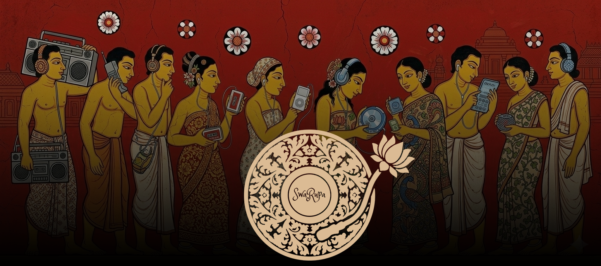

# SwaRupa

A collaborative music artwork database API for Sri Lankan Audiophiles.

SwaRupa allows users to submit, browse, and moderate album artwork. It is not a streaming service. The goal is to build a structured, crowdsourced metadata and artwork database for music albums for enthusiasts of Sri Lankan music and to whom metadata matters.

## Tech Stack

- Go
- Gin (HTTP router)
- pgx v5 + pgxpool (PostgreSQL driver)
- Supabase (hosted PostgreSQL)

## License
GNU GENERAL PUBLIC LICENSE